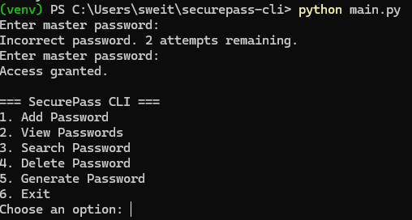
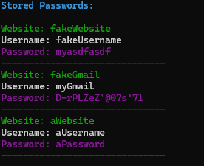
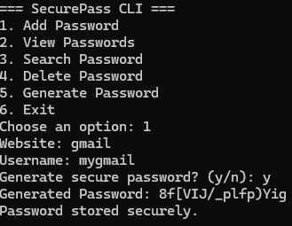
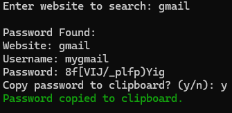
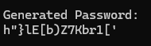

# SecurePass CLI

A secure command-line password manager built with Python.

## Features
- Encrypted password storage
- Master password authentication
- SQLite database
- Password generation
- Clipboard copy
- Password strength analysis

## Technologies
- Python
- SQLite
- cryptography
- bcrypt

## Installation
pip install -r requirements.txt

## Run
python main.py

## Screenshots

### Main Menu

### Password Vault

### Password Add

### Password Search

### Password Generator

